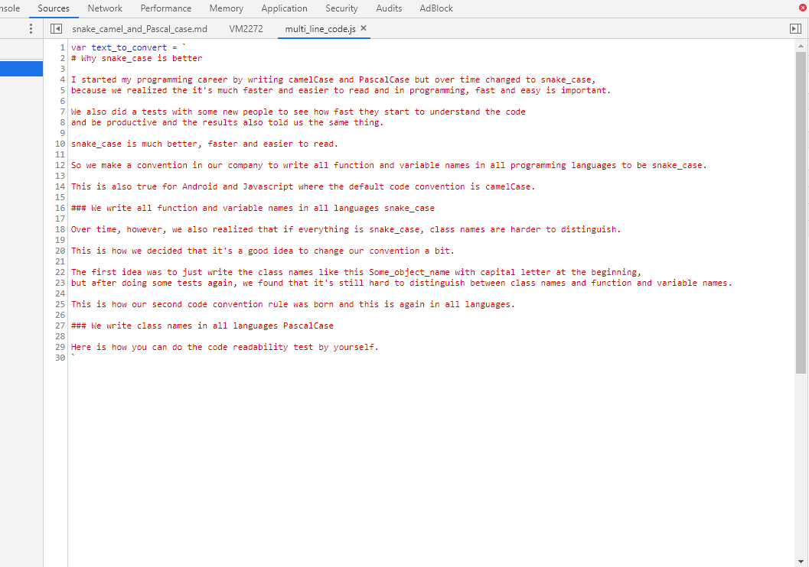

# Why snake_case is better

I started my programming career by writing camelCase and PascalCase but over time changed to snake_case, 
because we realized the it's much faster and easier to read and in programming, fast and easy is important.

We also did a tests with some new people to see how fast they start to understand the code 
and be productive and the results also told us the same thing.

snake_case is much better, faster and easier to read.

So we make a convention in our company to write all function and variable names in all programming languages to be snake_case.

This is also true for Android and Javascript where the default code convention is camelCase.

### We write all function and variable names in all languages snake_case

Over time, however, we also realized that if everything is snake_case, class names are harder to distinguish.

This is how we decided that it's a good idea to change our convention a bit.

The first idea was to just write the class names like this `Some_object_name` with capital letter at the beginning, 
but after doing some tests again, we found that it's still hard to distinguish between class names and function and variable names.

This is how our second code convention rule was born and this is again in all languages.

### We write class names in all languages PascalCase

Here is how you can do the code readability test by yourself.

See how fast you can read this text:
-----
> WhySnake_caseIsBetterIStartedMyProgrammingCareerByWritingCamelCaseAndPascalCaseButOverTimeChangedToSnake_caseBecauseWeRealizedTheItsMuchFasterAndEasierToReadAndInProgrammingFastAndEasyIsImportantWeAlsoDidaTestsWithSomeNewPeopleToSeeHowFastTheyStartToUnderstandTheCodeAndBeProductiveAndTheResultsAlsoToldUsTheSameThingSnake_caseIsMuchBetterFasterAndEasierToReadSoWeMakeaConventionInOurCompanyToWriteAllFunctionAndVariableNamesInAllProgrammingLanguagesToBeSnake_caseThisIsAlsoTrueForAndroidAndJavascriptWhereTheDefaultCodeConventionIsCamelCaseWeWriteAllFunctionAndVariableNamesInAllLanguagesSnake_caseOverTimeHoweverWeAlsoRealizedThatIfEverythingIsSnake_caseClassNamesAreHarderToDistinguishThisIsHowWeDecidedThatItsaGoodIdeaToChangeOurConventionaBitTheFirstIdeaWasToJustWriteTheClassNamesLikeThisSome_object_nameWithCapitalLetterAtTheBeginningButAfterDoingSomeTestsAgainWeFoundThatItsStillHardToDistinguishBetweenClassNamesAndFunctionAndVariableNamesThisIsHowOurSecondCodeConventionRuleWasBornAndThisIsAgainInAllLanguagesWeWriteClassNamesInAllLanguagesPascalCaseHereIsHowYouCanDoTheCodeReadabilityTestByYourself

Then do the same thing with this text:
-----

Here is how you can make a tests like this yourself.

#DIY

Create a new file and add text as a string.



The do the following Regex to get it like camelCase

```javascript
var capitalize_regex = /(\b[a-z](?!\s))/g;
camelCaseText = text_to_convert.replace(capitalize_regex, function(x){return x.toUpperCase();});
var remove_spaces_and_other_special_characters_regex = /[# ,\r\n.\'\`\"]/gi;
camelCaseText = camelCaseText.replace(remove_spaces_and_other_special_characters_regex, '');
console.log(camelCaseText);
```

And the following Regex to get it like snake_case


